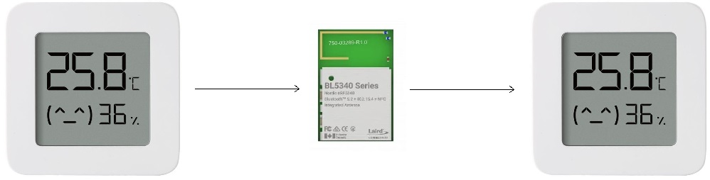

# LYWSD03MMC_Display

This project is using two Xiaomi Mijia Bluetooth thermometers, one for measuring the temperature outside and one for presenting it (remote dispaly). Since Telink SDK does not have a great Bluetooth central support, additional nrf5340 is used as a relay, reading the temperature from one sensor and writing it to the other one.

## Getting started

Telink SDK instructions:
https://github-com.translate.goog/Ai-Thinker-Open/Telink_825X_SDK?_x_tr_sl=auto&_x_tr_tl=en&_x_tr_hl=iw